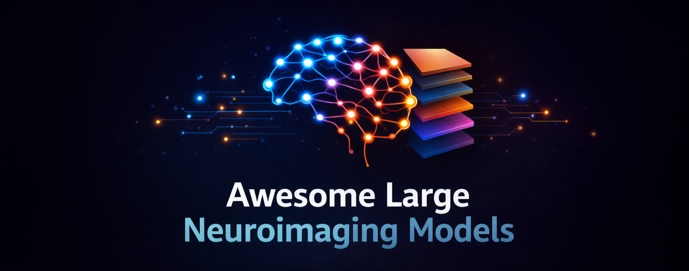

# Awesome Large Neuroimaging Models (LNMs)

A curated list of **large-scale foundation models for [neuroimaging](https://en.wikipedia.org/wiki/Neuroimaging) data**, including EEG, MEG, OPM, iEEG/ECoG, and fMRI.

These models—referred to here as **Large Neuroimaging Models (LNMs)**—are typically pretrained on large, heterogeneous datasets and adapted to a wide range of downstream tasks, including (but not limited to) brain–computer interfaces (BCIs), neural decoding, cognitive state inference, and disease classification.

This list focuses specifically on **models**, rather than general neuroscience software or analysis toolkits.

---

## Contents

- [Definition & Scope](#definition--scope)
- [Foundation & Pretrained Models](#foundation--pretrained-models)
- [Datasets for Pretraining](#datasets-for-pretraining)
- [Benchmarks & Tasks](#benchmarks--tasks)
- [Reviews & Surveys](#reviews--surveys)
- [Tooling & Infrastructure](#tooling--infrastructure)
- [Contributing](#contributing)

---

## Definition & Scope

In this list, a **Large Neuroimaging Model (LNM)** refers to a class of foundation models that satisfy *most* of the following criteria:

- Pretrained on **large-scale neuroimaging datasets**
- Support **multiple downstream tasks** (e.g., decoding, classification, forecasting)
- Generalise across **subjects, sessions, or datasets**
- Employ **scalable acchitectures** (often transformer-based)
- Provide **public code**, and ideally pretrained weights

**Out of scope**:
- Small, task-specific models
- Pure signal processing libraries
- Non-neural biosignals (e.g., ECG-only or EMG-only models)

---

## Foundation & Pretrained Models

### Electroencephalography (EEG)

- **LaBraM** – an encoder-only transformer-based foundaiton model designed for cross-dataset learning, pretrained on approximately 2,500 hours of EEG data.\
  [[Paper](https://arxiv.org/abs/2405.18765) | [Code](https://github.com/935963004/LaBraM) | [Weights](https://github.com/935963004/LaBraM/tree/main/checkpoints)] (*ICLR 2024*)

- **CBraMod** – a transformer-based foundation model equipped with a criss-cross attention mechanism to learn spatial and temporal attention in parallel.\
  [[Paper](https://arxiv.org/abs/2412.07236) | [Code](https://github.com/wjq-learning/CBraMod) | [Weights](https://huggingface.co/weighting666/CBraMod/tree/main)] (*ICLR 2025*)

- **REVE** – a large-scale foundation model trained on EEG data from 92 datasets spanning 25,000 subjects to generalise across acquisition devices and experimental protocols.\
  [[Paper](https://arxiv.org/abs/2510.21585) | [Code](https://brain-bzh.github.io/reve/) | [Weights](https://huggingface.co/collections/brain-bzh/reve)] (*NeurIPS 2025*)

### Magnetoencephalography (MEG)

- **MEG-GPT** – a decoder-only transformer-based foundation model pretrained on large-scale resting-state MEG data, capturing spatiotemporal and spectral characteristics of neural activity.\
  [[Paper](https://arxiv.org/abs/2510.18080) | [Code](https://github.com/OHBA-analysis/osl-foundation) | [Weights](https://huggingface.co/OHBA-analysis/MEG-GPT/tree/main)] (*arXiv 2025*)

### Functional Magnetic Resonance Imaging (fMRI)

- **BrainLM** – an encoder-decoder transformer model pretrained on 6,700 hours of fMRI recordings to learn transferable whole-brain representations.\
  [[Paper](https://www.biorxiv.org/content/10.1101/2023.09.12.557460v2) | [Code](https://github.com/vandijklab/BrainLM) | [Weights](https://huggingface.co/vandijklab/brainlm)] (*ICLR 2024*)

- **Brain-JEPA** – a self-supervised joint-embedding predictive architecture for learning generalisable representations of brain dynamics from fMRI data.\
  [[Paper](https://arxiv.org/abs/2409.19407) | [Code](https://github.com/Eric-LRL/Brain-JEPA) | [Weights](https://drive.google.com/drive/folders/1zoe5zjWkj2KY824XWTukrXxrMno2mlN5)] (*NeurIPS 2024*)

### Multimodal (e.g., EEG + fMRI)

- **BrainOmni** – an encoder-only transformer-based model pretrained on heterogenous EEG and MEG data (EEG + MEG).\
  [[Paper](https://arxiv.org/abs/2505.18185) | [Code](https://github.com/OpenTSLab/BrainOmni) | [Weights](https://huggingface.co/OpenTSLab/BrainOmni)] (*NeurIPS 2025*)

- **BrainHarmonix** - a vision transformer-based model that fuses representations of T1-weighted structural MRI images and functional MRI time series data (sMRI + fMRI).\
  [[Paper](https://arxiv.org/abs/2509.24693) | [Code](https://github.com/hzlab/Brain-Harmony) | [Weights](https://drive.google.com/drive/folders/12MkUAOcegU60YVlK8u8_Owmgk4eQVheB)] (*NeurIPS 2025*)

---

## Datasets for Pretraining

- **OpenNeuro** - an open-access platform that supports MRI, PET, MEG, EEG, iEEG, and NIRS datasets in BIDS format.\
  [[Website](https://openneuro.org/) | [Paper](https://doi.org/10.7554/eLife.71774) | CC0 Licence]

- **Cam-CAN** - the Cambridge Centre for Ageing and Neuroscience dataset comprising MRI and MEG recordings, designed to study the relationship between ageing and cognition.\
  [[Website](https://opendata.mrc-cbu.cam.ac.uk/projects/camcan/) | [Paper](https://doi.org/10.1186/s12883-014-0204-1) | N/A]

- **TUH-EEG Corpus** - a large-scale clinical EEG dataset collected at the Temple University Hospital, containing over 60,000 EEG recordings; acquisition ongoing since 2002.\
  [[Website](https://isip.piconepress.com/projects/tuh_eeg/) | [Paper](https://doi.org/10.3389/fnins.2016.00196) | N/A]

- **PhysioNet**
    - **Siena** - a scalp EEG dataset of 14 epileptic patients, recorded at the University of Siena.\
    [[Website](https://doi.org/10.13026/5d4a-j060) | CC BY 4.0]
    - **I-CARE** - a multimodal EEG and ECG dataset of 607 comatose patients following cardiac arrest, accompanied by clinical metadata.\
    [[Website](https://doi.org/10.13026/m33r-bj81) | CC BY-NC-SA 4.0]

---

## Benchmarks & Tasks

### Electroencephalography (EEG)

- **EEG-Bench** - a benchmark focused on evaluating EEG-based foundaiton models in clinical applications, featuring 14 datasets across 11 diagnostic tasks.\
  [[Paper](https://arxiv.org/abs/2512.08959) | [Code](https://github.com/ETH-DISCO/EEG-Bench)] (*NeurIPS 2025*)

- **EEG-FM-Bench** - a unified benchmark platform featuring 14 datasets across 10 canonical EEG paradigms, along with multiple evaluation and analysis methods.\
  [[Paper](https://arxiv.org/abs/2508.17742) | [Code](https://github.com/xw1216/EEG-FM-Bench)] (*arXiv 2025*)

- **AdaBrain-Bench** - a benchmark focused on evaluating foundaiton models in non-invasive BCI decoding tasks, including 13 datasets from 7 BCI tasks.\
  [[Paper](https://arxiv.org/abs/2507.09882) | [Code](https://github.com/Jamine-W/AdaBrain-Bench)] (*arXiv 2025*)

---

## Reviews & Surveys

### Electroencephalography (EEG)

- EEG Foundation Models: A Critical Review of Current Progress and Future Directions\
  [[Paper](https://openreview.net/forum?id=Iu6qVgtgUD)] (*NeurIPS 2025*)

---

## Tooling & Infrastructure

> [!NOTE]
> This section lists tools and resources that support training frameworks, data loading pipelines, data formatting standards, and reproducible experimentation.

- **BRAINDECODE** - a Python toolbox featuring deep learning models for decoding raw electrophysiological brain data, with support for data loading, preprocessing, and visualisation.\
  [[Website](https://braindecode.org/) | [Link](https://doi.org/10.5281/zenodo.16279624) | [Paper](https://doi.org/10.1002/hbm.23730)]

---

## Contributing

Contributions are welcome. Please read [CONTRIBUTING.md](CONTRIBUTING.md) before submitting a pull request.

#### 🙋‍♂️ Contact

If you have any questions, suggestions, or concerns regarding this list, please contact [me](mailto:sungjun.cho@ndnc.ox.ac.uk) or open an issue on GitHub.

---

## Licence

This list is released under the **CC0 1.0 Universal** licence.
